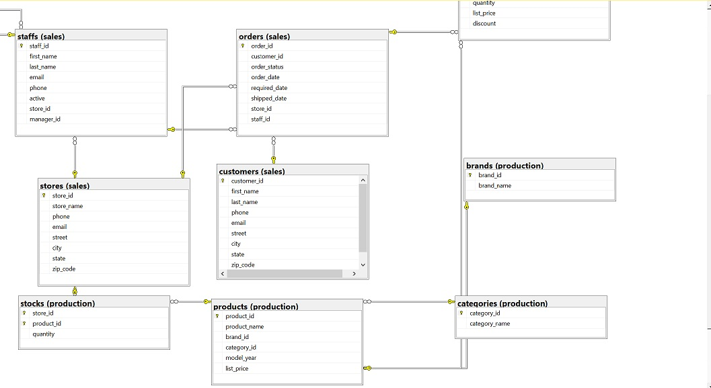

# Bikestore Data Analysis Project

## Table of Contents
- [Project Overview](#project-overview)
- [Technologies Used](#technologies-used)
- [Project Highlights](#project-highlights)
- [Database Schema](#database-schema)
- [Data Extraction and Transformation](#data-extraction-and-transformation)
- [Dashboard Creation](#dashboard-creation)

## Project Overview
This project involves the analysis of data from a bike store using Microsoft SQL Server for database management. The objective was to gain insights into the store's sales, inventory, and customer behavior. The project includes data modeling, data extraction, and the creation of interactive dashboards using Excel and Tableau.

## Technologies Used
- Microsoft SQL Server
- Excel
- Tableau

## Project Highlights
- **Data Modeling**: Designed a comprehensive database schema to organize and manage data efficiently, including tables for sales, products, customers, and more.

- **Data Extraction and Transformation**: Wrote SQL queries to extract relevant data from the database. Performed data cleaning and transformation to prepare the data for analysis.

- **Dashboard Creation**: Created interactive dashboards in Excel and Tableau to visualize key performance metrics, sales trends, and customer insights.

## Database Schema
Below is a representation of the database schema used in this project:

## Data Extraction and Transformation
To extract and transform data for analysis, various SQL queries were used. Sample queries include:

- Extracted sales data for the past year.
- Calculated monthly revenue and sales growth.
- Identified top-selling products.

## Dashboard Creation
Interactive dashboards were created using Excel and Tableau to visualize and present the analysis results. You can find the Tableau dashboard  <a href = "https://public.tableau.com/app/profile/chukwudi.ekweani8026/viz/ExecutiveDashbaordforBikeStore/Dashboard1?publish=yes"> here </a>.
